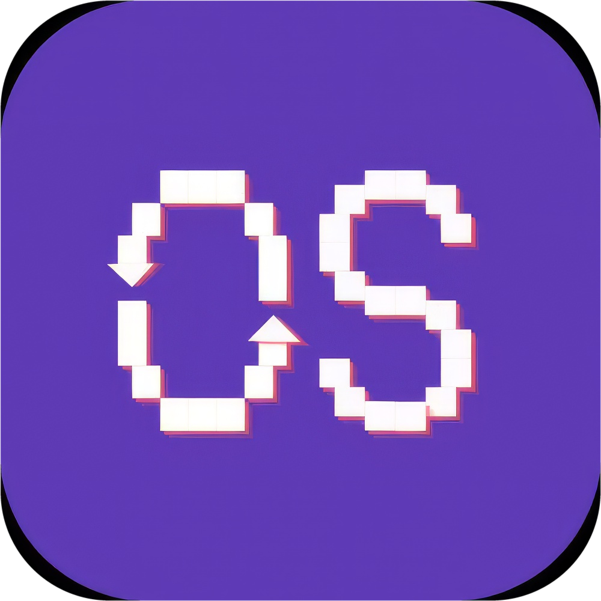
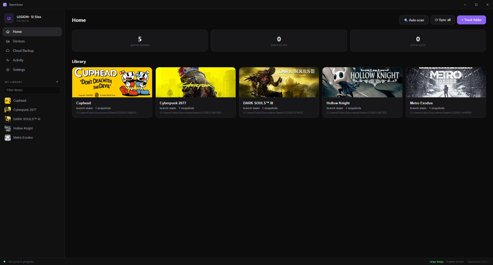
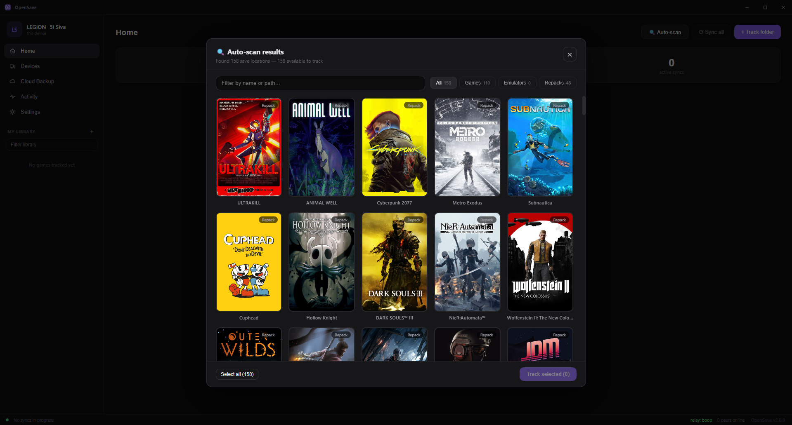
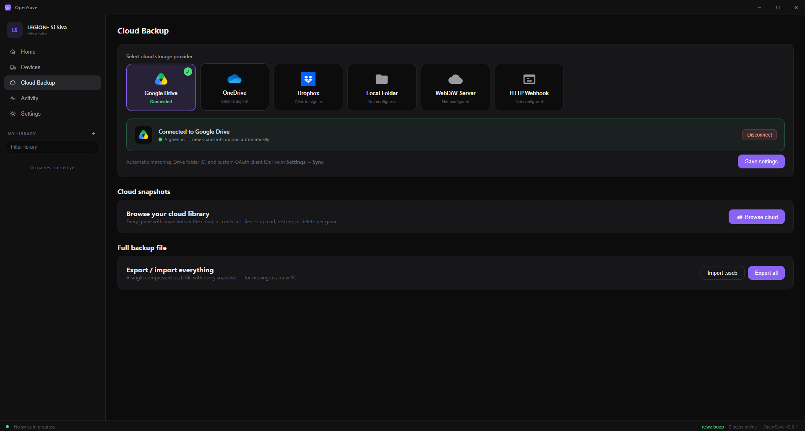
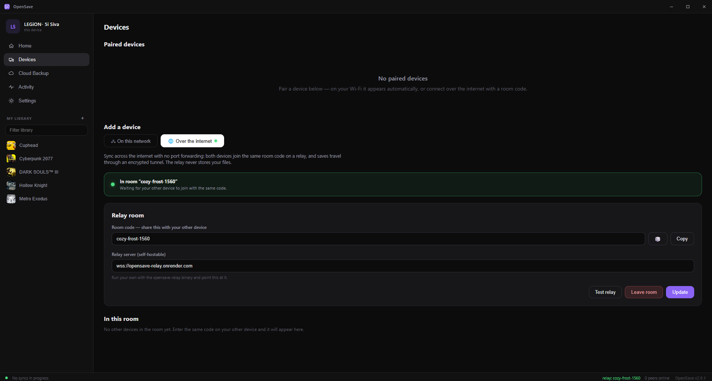
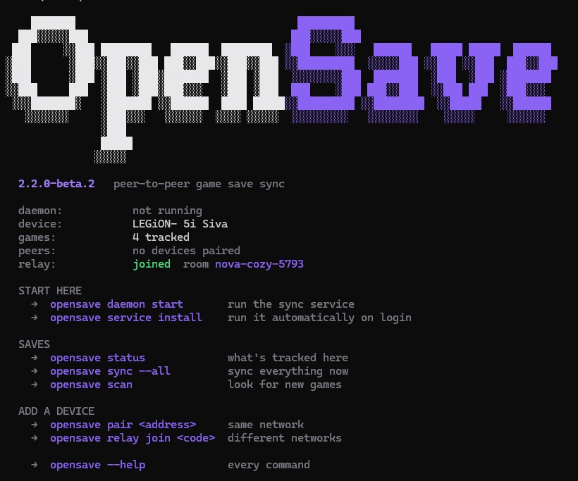

<div align="center">



# OpenSave

### Steam Cloud for every game you own.

**OpenSave** syncs your game saves between devices, peer-to-peer — no Steam required, no accounts, no subscriptions. Point it at a folder, pair your devices, and your saves follow you everywhere.

[](https://github.com/Liquid-co/OpenSave/releases)
[](LICENSE)
[](https://discord.gg/hvBv92DZvn)
[](https://go.dev)


*A complete Go rewrite of the original Node.js/Electron app: one small native binary, no runtime to install, and wire-compatible with existing peers.*

[Install](#install) · [Quick start](#quick-start) · [Screenshots](#screenshots) · [How it works](#how-it-works) · [CLI](#command-line) · [Self-host the relay](#self-hosting-the-relay) · [FAQ](#faq) · [**Discord**](https://discord.gg/hvBv92DZvn)

<br>



</div>

---

## Why OpenSave

Steam Cloud only covers games bought on Steam — and only when the developer opts in. Everything else (emulators, GOG, Epic, single-player games with no cloud support) is on you: manually copying save folders between your desktop, laptop, and Steam Deck, and hoping you grabbed the newest one.

OpenSave gives **every** game the Steam Cloud experience:

- **You own it.** Saves sync directly between *your* devices. No account to create, nothing stored on someone else's server.
- **It's automatic.** Auto-detects hundreds of games, watches for changes, and syncs the moment a save is written.
- **It's safe.** Every change is snapshotted and reversible. Conflicts are detected and resolved without silently clobbering a playthrough.

## Features

- **Auto-detection** — scans for saves from Steam, emulators (RetroArch, Dolphin, Ryujinx, Yuzu, Citra, PCSX2, RPCS3, PPSSPP, Cemu, Xenia), Steam-emulator repacks (Goldberg/GSE, CODEX, RUNE, Tenoke, EMPRESS, Online-Fix, CPY, SKIDROW, 3DM, …), Epic, GOG, Unity `LocalLow`, and Unreal Engine conventions — plus the community-maintained [Ludusavi manifest](https://github.com/mtkennerly/ludusavi-manifest) covering save paths for tens of thousands of games, whatever store (or no store) they came from.
- **Track anything** — any folder or single save file, watched live with block-level change detection (SHA-256, 64 KB–2 MB adaptive blocks). Only the blocks that changed are ever transferred.
- **P2P sync** — automatic over LAN (zero-config discovery) or across the internet through a relay **room code** — no port forwarding. A paired-device model means every connection is explicitly approved.
- **Snapshot history** — every change creates a versioned snapshot. Roll back a whole save or a single file; branches keep parallel playthroughs (and conflict resolutions) safe.
- **Smart conflict handling** — diverged saves are detected by **sync lineage**, not wall-clock timestamps. Keep yours, keep theirs, or keep both on a new branch.
- **Cloud backup** — optional mirroring to Google Drive, Dropbox, OneDrive, WebDAV, a webhook, or a local/NAS folder.
- **Cross-device game matching** — the same title tracked under different names on two machines (a Steam install here, a differently-named folder there) can be matched by Steam App ID or linked by hand. App-ID matching is opt-in, so two separate copies of a game are never merged without asking.
- **A full command line** — `opensave` does everything the app does, for a Steam Deck in Game Mode or a headless server. See [Command line](#command-line).
- **In-app updates** — one-click update from GitHub releases, pull a newer build straight from a paired device, or `opensave update` from the terminal.
- **Privacy-first** — no accounts, no telemetry. The relay only routes encrypted WebSocket frames and never stores your saves.

## Screenshots

<table>
  <tr>
    <td align="center">
      <br>
      <sub><b>Auto-scan</b> — 158 saves found on this PC, shown as cover art. Games, emulators, and repacks, one click to track.</sub>
    </td>
    <td align="center">
      <br>
      <sub><b>Cloud backup</b> — mirror snapshots to Drive, Dropbox, OneDrive, WebDAV, or a NAS folder. Optional; P2P needs no cloud.</sub>
    </td>
  </tr>
  <tr>
    <td align="center">
      <br>
      <sub><b>Internet sync</b> — pair devices anywhere with a room code. No port forwarding, and the relay never stores saves.</sub>
    </td>
    <td align="center">
      <br>
      <sub><b>Your library</b> — every tracked game with its branch and snapshot history, one Sync all button away.</sub>
    </td>
  </tr>
</table>

## Install

| Platform | Download | Run |
|---|---|---|
| **Windows** | `OpenSave.Setup.exe` (installer) or portable `OpenSave.exe` | Double-click |
| **Linux** | `opensave-linux-amd64.tar.gz` | extract, then `./opensave` |
| **Steam Deck / SteamOS** | `OpenSave.flatpak` | see [Steam Deck install](#steam-deck-install) |

Grab the latest from the [**Releases**](https://github.com/Liquid-co/OpenSave/releases) page.

### Steam Deck install

> **Use `OpenSave.flatpak`, not `opensave-linux-amd64.tar.gz`.** The tarball's
> desktop app will not start on a stock Deck: SteamOS ships no WebKitGTK, which
> it needs to draw its window. This trips people up because the tarball's name
> reads like the Steam Deck build.

The Flatpak is the build that works on a stock Deck — SteamOS ships no
WebKitGTK and wipes manually-installed system packages on OS updates; the
Flatpak bundles everything and survives updates.

1. Switch to **Desktop Mode** (Steam button → Power → Switch to Desktop).
2. Download `OpenSave.flatpak` from the [Releases](https://github.com/Liquid-co/OpenSave/releases) page.
3. Double-click it to install via Discover, or run
   `flatpak install --user OpenSave.flatpak` in Konsole.
4. Launch OpenSave from the application menu. Optional: add it to Steam
   (right-click → *Add to Steam*) to open it from Game Mode.

If you only want background syncing and no window, the **command line has no
such constraint** — it needs no WebKitGTK and runs anywhere:

```bash
curl -fsSL https://raw.githubusercontent.com/Liquid-co/OpenSave/main/scripts/install.sh | sh
opensave scan && opensave service install
sudo loginctl enable-linger $USER
```

Saves on the SD card are found automatically (`/run/media` is visible to
the app), and Proton game saves are detected inside their `compatdata`
prefixes. The plain Linux tarball also works on the Deck if you install
`webkit2gtk-4.1` yourself, but SteamOS updates can remove it — the
Flatpak is the supported path. A Decky plugin for Game Mode lives in
[`opensave-decky-plugin/`](opensave-decky-plugin/).

**Other handhelds / Arch-based distros (CachyOS, Bazzite-likes):** if
your distro is *not* immutable (CachyOS isn't), the plain Linux tarball
with your distro's `webkit2gtk-4.1` package is the best install — it
survives updates and uses your native graphics stack. The Flatpak is
for immutable systems like stock SteamOS.

**Troubleshooting:**
- *"runtime org.gnome.Platform … not found"* during install — your
  flatpak user installation doesn't have Flathub configured yet:
  `flatpak remote-add --if-not-exists --user flathub https://dl.flathub.org/repo/flathub.flatpakrepo`
  then install the bundle again.
- The app must be launched in **Desktop Mode** (or added to Steam to run
  from Game Mode) — running it from a bare terminal session shows no
  window.

> **Upgrading from the original (JS) OpenSave?** Your data migrates automatically on first launch — tracked games, snapshots, pairings, and cloud settings are imported from `~/.opensave/opensave-db.json` (kept as a backup, never deleted). Go and JS devices can pair and sync with each other during the transition.

## Quick start

1. **Launch OpenSave** on your first device. It scans for installed games and shows detected saves as cover-art tiles.
2. **Track a game** — click a detected tile, or add any folder / save file manually.
3. **Pair a second device.** On the same network, the other device appears automatically under **Devices** — approve the request. Remote? One device creates a **room code** under **Internet Sync**; the other joins with it.
4. **Play.** When a save changes, OpenSave snapshots it and syncs it to every paired device. There's nothing else to do.

Need to undo something? Open a game's **history** and roll back a snapshot — the whole save or a single file.

## How it works

```
   Device A                        Device B
 ┌──────────┐   LAN (auto-discovery)   ┌──────────┐
 │ watcher  │◀───────────────────────▶│ watcher  │
 │ snapshot │                          │ snapshot │
 │  delta   │   WAN via relay room     │  delta   │
 └────┬─────┘   (encrypted frames)     └────┬─────┘
      │            ┌───────────┐            │
      └───────────▶│   relay   │◀───────────┘
                   │ (routes,  │
                   │  no data) │
                   └───────────┘
```

1. **Watch** — a filesystem watcher notices a save was written (safe-write and file-lock aware, so it never grabs a half-flushed file).
2. **Delta** — the save is chunked into content-defined blocks and SHA-256 hashed. A manifest diff finds exactly which blocks changed.
3. **Snapshot** — the new state is recorded as an immutable, versioned snapshot on a branch.
4. **Sync** — only the changed blocks travel to paired peers, over LAN when possible or through a stateless relay room otherwise. Lineage metadata lets the receiver detect a genuine conflict versus a fast-forward.

## Command line

`opensave` is a complete client, not a companion to the app: auto-detect saves,
pair devices, sync, resolve conflicts, manage snapshots and branches, back up
to the cloud, and run as a background service. A headless box — a NAS, a home
server, or a Steam Deck that lives in Game Mode — never needs the desktop app.

No account, no token, no server to sign up to.

<p align="center">
  
</p>

Run `opensave` on its own and it tells you what is happening right now, and what
to do next. There is a fuller walkthrough on the
[website](https://open-save.vercel.app/cli.html).

### Install

**Linux & Steam Deck**

```bash
curl -fsSL https://raw.githubusercontent.com/Liquid-co/OpenSave/main/scripts/install.sh | sh
```

**Windows** (PowerShell)

```powershell
irm https://raw.githubusercontent.com/Liquid-co/OpenSave/main/scripts/install.ps1 | iex
```

Installs to your user folder — no root, no admin — puts it on your `PATH`, and
shows the status panel when it is done. Downloads are verified against the
`SHA256SUMS` published with each release; piping a script into a shell is enough
trust on its own.

Three names, one program: **`opensave`**, **`os`** as a short alias, and
`opensave-cli` (the name the Steam Deck plugin and the Linux packages use
internally). If something on your system already answers to `os`, the installer
leaves it alone and says so.

To choose where it lands or pin a version:

```bash
OPENSAVE_INSTALL_DIR=/usr/local/bin OPENSAVE_VERSION=v2.2.0 sh install.sh
```

Or build it: `go build -o opensave ./cmd/opensave-cli`

### Keeping it current

```bash
opensave update            # replace this binary with the latest release
opensave update --check    # just report whether a newer one exists
```

Pre-releases are never offered automatically — install those yourself from the
releases page.

### Getting started

```bash
opensave scan                          # what is on this machine
opensave add "Elden Ring" ~/.local/share/EldenRing
opensave daemon start &                # the sync service
opensave pair 192.168.1.42             # pair another device on the LAN
opensave sync --all
```

Different networks instead of a LAN? Run `opensave relay join <code>` with the
same made-up code on both devices — no port forwarding, and the relay only
passes encrypted data through without storing it.

### Run it permanently

```bash
opensave service install
systemctl --user enable --now opensave-daemon
sudo loginctl enable-linger $USER     # Steam Deck: survive Game Mode switches
```

That last line matters on a Deck. Without it SteamOS stops your background
services the moment you switch to Game Mode — which is exactly when you want
syncing to be happening.

### Command reference

Every command accepts `--json` for scripting.

**Games**

| Command | What it does |
| --- | --- |
| `scan` | Auto-detect saves: Steam libraries, Proton and Wine prefixes, emulators, 20k+ titles via the Ludusavi manifest |
| `add <name> <path>` | Track a save folder or file |
| `remove <gameId>` | Stop tracking. Save files and snapshots stay on disk |
| `untrack-all --yes` | Stop tracking everything (snapshots are kept) |
| `game <gameId> set <key> <value>` | Per-game settings: `path`, `app-id`, `exe-path`, `cover-url`, `auto-sync`, `max-snapshots` |
| `launch <gameId>` | Start the game |
| `status` | Tracked games, branches, peers |

**Sync & devices**

| Command | What it does |
| --- | --- |
| `sync [<gameId>\|--all]` | Sync now; everything by default |
| `peers` | Paired devices, devices found on this network, pending requests |
| `pair <host[:port]>` | Ask a device on the LAN to pair |
| `pair requests` | Show incoming requests, and which device sent them |
| `pair approve\|reject <peerId>` | Answer one |
| `unpair <peerId>` | Drop a paired device |
| `probe <host[:port]>` | Check whether a device answers — works before pairing |
| `forget <peerId>` | Remove a stale device record |
| `relay join <code>` | Sync across networks — same code on each device |
| `relay status\|leave` | Show or leave the relay room |
| `conflicts` | Saves that diverged and are waiting on a decision |
| `resolve <gameId> <choice>` | `keep-both` (safest), `keep-local`, `keep-remote` |

**History**

| Command | What it does |
| --- | --- |
| `snapshot <gameId> [comment]` | Snapshot the current save |
| `snapshots <gameId>` | List snapshots, newest first |
| `rollback <gameId> <snapId>` | Restore a snapshot |
| `branch <gameId> <name>` | Create a branch for a parallel playthrough |
| `checkout <gameId> <name>` | Switch branch |
| `branch-delete <gameId> <name>` | Delete a branch and its snapshots |
| `snapshot-delete <gameId> <snapId>` | Delete one snapshot |
| `prune [--apply-default]` | Apply snapshot retention limits now |
| `files <gameId> <snapId> [path]` | List a snapshot's contents, or restore a single file from it |
| `export <gameId> <dir>` | Copy the save out exactly as the game wrote it — no archive, no wrapper |
| `backup export\|import <file.sscb>` | Portable backup archive |

**Cloud backup**

| Command | What it does |
| --- | --- |
| `cloud status` | Provider and connection state |
| `cloud browse` | Everything stored in the cloud |
| `cloud list <gameId>` | Cloud snapshots for one game |
| `cloud push <gameId>` | Upload local snapshots |
| `cloud restore <gameId> <file>` | Pull one back |
| `cloud delete <gameId> --yes` | Remove a game's cloud copies |

Google Drive, Dropbox and OneDrive need a browser to grant consent, so those are
connected once in the desktop app. WebDAV, webhook and local/NAS providers work
entirely from the terminal.

**Configuration**

| Command | What it does |
| --- | --- |
| `config [list]` | Show settings |
| `config set <key> <value>` | `device-name`, `match-by-app-id`, `snapshot-limit`, `relay-url` |
| `scanpath list\|add\|remove <path>` | Extra folders for auto-scan to check |
| `exclude list\|add\|remove <path>` | Folders auto-scan should skip |
| `link <gameId> <otherId>` | Treat two tracked games as the same game |
| `unlink <aliasId>` / `links <gameId>` | Undo a link / show linked ids |

**Service**

| Command | What it does |
| --- | --- |
| `daemon start [--port N]` | Run the daemon in the foreground |
| `daemon status` / `daemon stop` | Check on, or stop, a daemon started by the CLI |
| `service install\|uninstall\|status` | Manage the `systemd --user` unit (Linux) |
| `completion bash\|zsh\|fish` | Shell completion script |
| `upnp <port> [--delete]` | Forward a router port via UPnP |
| `update [--check]` | Update this binary from the latest release |
| `version` | Print the version |

### Scripting

```bash
opensave daemon status --json | jq .gameCount
opensave snapshots elden-ring --json | jq -r '.[0].id'
opensave conflicts --json | jq 'keys'
```

Failures exit non-zero and, with `--json`, print `{"error": "..."}`.

Full details: `man opensave` (shipped in the Linux tarball), or
[`packaging/man/opensave.1`](packaging/man/opensave.1).

The daemon exposes a local REST + WebSocket API (P2P on port `8383`) that the
desktop UI, the CLI and the Steam Deck plugin all drive, so anything the app
can do is scriptable.

## Build from source

```bash
# Desktop app (needs Go 1.26+, Node 18+, and the Wails CLI)
go install github.com/wailsapp/wails/v2/cmd/wails@latest
cd cmd/opensave-app && wails build

# Headless daemon + CLI
go build ./cmd/opensave-cli

# Relay server (self-host)
go build ./cmd/opensave-relay
```

Run the test suite:

```bash
go test ./...          # unit tests
go test ./e2e/...      # end-to-end pairing & sync tests
```

## Self-hosting the relay

The relay is stateless — it brokers room codes and proxies OAuth, but never sees or stores your saves. Run your own for full control:

```bash
./opensave-relay                     # listens on :8386
PORT=10000 ./opensave-relay          # custom port
docker build -f relay/Dockerfile .   # or as a container
```

Point **Settings → Internet Sync → Relay server** at your instance. `opensave upnp 8386` forwards the port on UPnP-capable routers.

## Architecture

```
cmd/opensave-app       Wails desktop app (daemon embedded + Svelte UI)
cmd/opensave-cli       Headless daemon & CLI
cmd/opensave-relay     Stateless WAN relay (room broker + OAuth proxy)
internal/
  store                SQLite persistence + legacy JSON import
  delta                Block hashing, manifest diff, patching
  snapshot             ZIP snapshots, branches, retention
  watcher              Save-change detection (safe-write aware, lock guard)
  p2p                  Discovery, pairing, sync engine, LAN/WAN transports
  cloud                Backup providers + PKCE OAuth
  presets              Game / emulator / store save-location detection
  api                  Local REST + WebSocket dashboard API
  daemon               Long-running service orchestration
  sysintegration       Tray, notifications, autostart
opensave-decky-plugin  Steam Deck Game Mode plugin (Decky Loader)
```

The daemon speaks the same REST/WebSocket API and P2P wire protocol as the original JS app, so old and new versions interoperate during a rollout.

## Data & privacy

Everything lives under `~/.opensave/`:

| Path | What |
|---|---|
| `opensave.db` | SQLite store — tracked games, snapshots, pairings, settings |
| `snapshots/` | Versioned save snapshots |
| `opensave.log` | Activity log for diagnostics |
| `opensave-db.json` | Legacy JS database (kept as an import backup) |

No accounts, no telemetry, no analytics. See [PRIVACY.md](PRIVACY.md) for the full statement.

## FAQ

**Do I need a server or an account?**
No. Devices sync directly. The optional relay only matters for syncing across the internet, and you can self-host it.

**Is my data encrypted in transit?**
Yes — WAN sync travels as encrypted WebSocket frames through the relay, which routes frames without storing them.

**What if two devices change the same save while offline?**
OpenSave detects the divergence by sync lineage and asks you to keep yours, theirs, or both (on a new branch). It never silently overwrites.

**Does it work with non-Steam or emulated games?**
Yes. If it writes a save to disk, OpenSave can track it — Steam, emulators, GOG, Epic, and repacks are auto-detected; anything else you can add by path.

**Can old (JS) and new (Go) versions talk to each other?**
Yes, during the transition. They share the same wire protocol and your data migrates automatically.

## Contributing

Issues and pull requests are welcome. Please run `go test ./...` before opening a PR, and keep changes focused. For larger features, open an issue first so we can align on approach.

## Documentation

- [User Guide](USER_GUIDE.md) — first run, syncing, snapshots, cloud backup, troubleshooting
- [Changelog](CHANGELOG.md) — release notes
- [Privacy](PRIVACY.md) — what OpenSave does and doesn't do with your data

## License

[MIT](LICENSE) — retains the original author's copyright and credits the Go rewrite.
